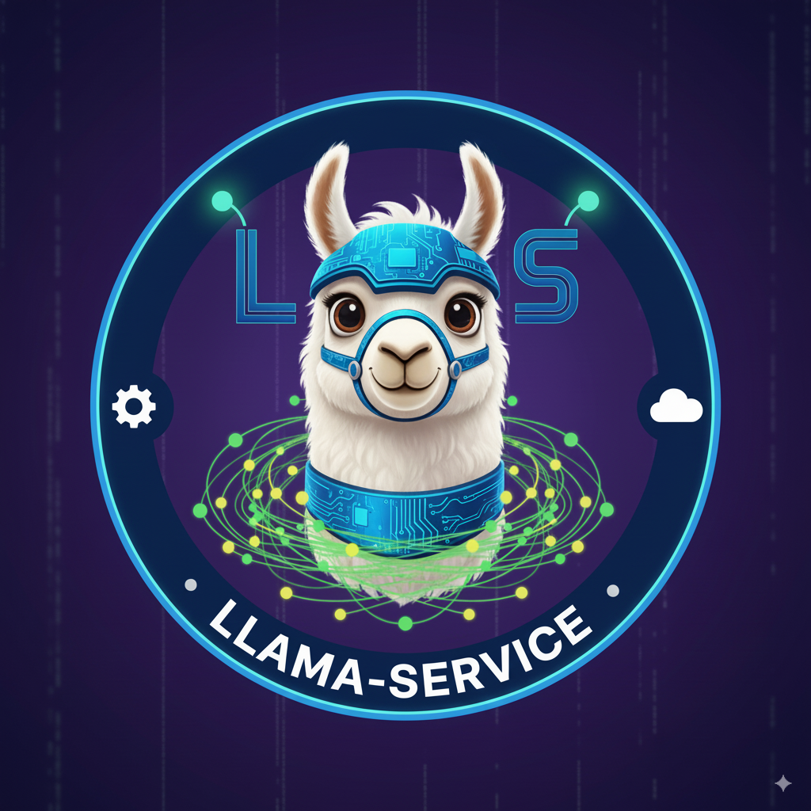

# 🚀 LLama Server - Complete Auto-Setup Solution

<p align="center">
  
</p>

<p align="center">
  <a href="#-supported-platforms"></a>
  <a href="#-docker-usage"></a>
  <a href="#-testing--api-usage"></a>
  <a href="#-manual-setup-if-auto-setup-fails"></a>
</p>

**One-click setup for LLama server on any platform!**

 LLama server implementation with automatic setup, dependency management, and cross-platform support. 

---

## 📚 Table of Contents

- [⚡ Super Quick Start](#-super-quick-start)
- [🔧 Manual setup if auto-setup fails](#-manual-setup-if-auto-setup-fails)
- [🖥️ Supported Platforms](#-supported-platforms)
- [📋 What Auto-Setup Does](#-what-auto-setup-does)
- [📁 Directory Structure After Setup](#-directory-structure-after-setup)
- [🎯 Usage After Setup](#-usage-after-setup)
- [🧪 Testing & API Usage](#-testing--api-usage)
- [🔧 Features](#-features)
- [🛠️ Advanced Configuration](#-advanced-configuration)
- [🆘 Troubleshooting](#-troubleshooting)
- [🔄 Updates & Maintenance](#-updates--maintenance)
- [🐳 Docker Usage](#-docker-usage)
- [🇷🇺 Русская версия](#-быстрый-старт-русский)

## ⚡ Super Quick Start

### All Platforms
1) Download a GGUF model to `models/` (recommended Phi-4-mini):
   - Source: https://huggingface.co/matrixportalx/Phi-4-mini-instruct-Q4_K_M-GGUF
   - File name: `models/phi-4-mini-instruct-q4_k_m.gguf`

2) Run the auto-setup script:
```bash
python main.py
```

3) Start the server using the generated script (`start.bat` on Windows or `./start.sh` on Linux/macOS).

The auto-setup handles the server binary and dependencies automatically:
- ✅ Auto-installs its own dependencies (requests)
- ✅ Detects your platform and downloads correct files
- ✅ Creates platform-specific startup scripts

Note: If auto-setup fails to fetch the correct server for your OS/arch, see the manual setup steps below.

## 🔧 Manual setup if auto-setup fails

If the auto-setup script can’t fetch the correct llama server binary for your OS/arch, follow these steps:

1) Download the correct llama.cpp server build from: https://github.com/ggml-org/llama.cpp/releases
- Windows x64: grab the zip containing `llama-server.exe` from the latest llama.cpp release
- Linux x64/ARM64: grab the zip containing `llama-server`
- macOS Intel/ARM64: grab the zip containing `llama-server`

2) Extract the archive locally and copy files into the project root
- Place the server binary as:
  - Windows: `server.exe`
-  Linux/macOS: `server`
- Copy all required libraries next to it (DLLs on Windows, `.so` on Linux, `.dylib` on macOS)

3) Create the models directory and add a GGUF model
```bash
mkdir -p models
# Download the model:
# https://huggingface.co/matrixportalx/Phi-4-mini-instruct-Q4_K_M-GGUF
# Place as: models/phi-4-mini-instruct-q4_k_m.gguf
```

4) Create a startup script
- Windows `start.bat`:
```bat
@echo off
set MODEL_PATH=models\phi-4-mini-instruct-q4_k_m.gguf
set HOST=0.0.0.0
set PORT=8080
set CONTEXT_SIZE=4096
set THREADS=8
set GPU_LAYERS=0

server.exe ^
  -m "%MODEL_PATH%" ^
  --host "%HOST%" ^
  --port "%PORT%" ^
  -c "%CONTEXT_SIZE%" ^
  -t "%THREADS%" ^
  --n-gpu-layers "%GPU_LAYERS%"
```

- Linux/macOS `start.sh`:
```bash
#!/usr/bin/env bash
set -euo pipefail
MODEL_PATH="models/phi-4-mini-instruct-q4_k_m.gguf"
HOST="0.0.0.0"
PORT="8080"
CONTEXT_SIZE="4096"
THREADS="8"
GPU_LAYERS="0"

chmod +x ./server
./server \
  -m "$MODEL_PATH" \
  --host "$HOST" \
  --port "$PORT" \
  -c "$CONTEXT_SIZE" \
  -t "$THREADS" \
  --n-gpu-layers "$GPU_LAYERS"
```

5) Start and test
```bash
# Windows
start.bat

# Linux/macOS
./start.sh

# Health
curl http://localhost:8080/health
```

## 🖥️ Supported Platforms

| Platform | Architecture | Status |
|----------|-------------|---------|
| Windows | x64 | ✅ Fully Supported |
| Linux | x64 | ✅ Fully Supported |
| Linux | ARM64 | ✅ Fully Supported |
| macOS | Intel (x64) | ✅ Fully Supported |
| macOS | Apple Silicon (ARM64) | ✅ Fully Supported |

## 📋 What Auto-Setup Does

1. ✅ **Detects your platform** (Windows/Linux/macOS, x64/ARM64)
2. ✅ **Downloads server executable** (correct version for your system)
3. ✅ **Downloads all dependencies** (DLLs, shared libraries)
4. ✅ **Creates startup scripts** (platform-optimized)
5. ✅ **Creates test utilities** (API testing script)
6. ✅ **Sets up directory structure** (models folder, documentation)

## 📁 Directory Structure

```
your-project/
├── main.py                               # Entry point script
├── setup.py                              # Core setup class
├── platform_detector.py                  # Platform detection module
├── downloader.py                         # Download utilities
├── extractor.py                          # File extraction utilities
├── file_creator.py                       # Startup/test scripts creator
├── auto_setup_llama.py                   # Legacy setup script
├── models/                               # Model files directory
│   ├── phi-4-mini-instruct-q4_k_m.gguf  # AI model (2.2GB)
│   └── README.md                        # Model download guide
├── server.exe (or server)               # Main executable (after setup)
├── *.dll (or *.so/*.dylib)             # Required libraries (after setup)
├── start.bat (or start.sh)             # Startup script (after setup)
├── test_api.py                          # API test script (after setup)
├── Dockerfile                            # Docker configuration
└── README.md                            # This file
```

## 🎯 Usage After Setup

Refer to Super Quick Start steps (download GGUF → run auto-setup → start script).

- Optional: Run `python test_api.py` to verify endpoints
- Open the Web UI at http://localhost:8080

## 🎉 You're Done!

Your LLama server is running at `http://localhost:8080` with:
- ✅ OpenAI-compatible API endpoints
- ✅ Web interface for testing
- ✅ All dependencies properly configured

## 📋 What Gets Downloaded

### Windows
- `server.exe` - LLama server executable
- `ggml-base.dll` - Core GGML library
- `ggml-cpu-*.dll` - CPU optimization libraries
- `ggml.dll` - GGML interface
- `llama.dll` - LLama library
- `libcurl-x64.dll` - HTTP client
- `libomp140.x86_64.dll` - OpenMP runtime
- Additional support DLLs

### Linux/macOS
- `server` - LLama server executable
- `*.so` / `*.dylib` - Shared libraries
- All required dependencies

 

## 🧪 Testing & API Usage

### Test Everything Works
```bash
# Run the comprehensive test script
python test_api.py

# Or check manually
curl http://localhost:8080/health
```

<details>
<summary><strong>API Examples (expand)</strong></summary>

#### Simple Completion
```bash
curl -X POST http://localhost:8080/completion \
  -H "Content-Type: application/json" \
  -d '{
    "prompt": "What is artificial intelligence?",
    "n_predict": 100,
    "temperature": 0.7
  }'
```

#### OpenAI-Compatible Chat
```bash
curl -X POST http://localhost:8080/v1/chat/completions \
  -H "Content-Type: application/json" \
  -d '{
    "model": "phi-4-mini",
    "messages": [{"role": "user", "content": "Hello!"}],
    "max_tokens": 50
  }'
```

Note: The "model" field is required for OpenAI compatibility but the actual model used is whatever GGUF file you loaded (e.g., `phi-4-mini-instruct-q4_k_m.gguf`).

#### Health Check
```bash
curl http://localhost:8080/health
```

#### Server Info
```bash
curl http://localhost:8080/v1/models
```

</details>


## 🔧 Features

### Smart Platform Detection
- Automatically detects Windows/Linux/macOS
- Identifies x64/ARM64 architecture
- Downloads correct binaries for your system

### Complete Dependency Management
- Downloads ALL required files
- No missing DLL/library issues
- Ready-to-run setup

### User-Friendly Scripts
- Platform-appropriate startup scripts
- Comprehensive test scripts
- Clear error messages and guidance

### Progress Tracking
- Download progress bars
- Step-by-step status updates
- Clear success/failure indicators

### Production Ready
- **High performance**: Native C++ llama.cpp implementation
- **OpenAI-compatible API**: Drop-in replacement for OpenAI endpoints
- **Low memory footprint**: Minimal resource usage
- **Fast startup**: No model loading delays

## 🛠️ Advanced Configuration

### Custom Configuration
Edit the generated startup script to modify:
- Model path
- Server host/port
- Context size
- Thread count
- GPU layers

### Multiple Models
- Place multiple GGUF files in `models/`
- Update startup script MODEL_PATH variable
- Switch between models as needed

### Server Configuration Options

| Option | Description | Default |
|--------|-------------|---------|
| `-m, --model` | Path to model file | Required |
| `--host` | IP address to bind to | 0.0.0.0 |
| `--port` | Port to listen on | 8080 |
| `-c, --ctx-size` | Context window size | 4096 |
| `-t, --threads` | Number of threads | 8 |
| `--n-gpu-layers` | GPU layers to offload | 0 |
| `--log-disable` | Disable logging | false |

## 🆘 Troubleshooting

### Setup Problems
- **Python not found**: Install Python 3.7+ from python.org, ensure "Add to PATH" is checked
- **Download fails**: Check internet connection, try running setup again (auto-resumes)
- **Requests install fails**: Manually run `pip install requests` then retry setup

### Server Problems  
- **Model not found**: Download a GGUF model to `models/` folder
- **Port busy**: Change PORT in startup script
- **Out of memory**: Use smaller model or reduce context size
- **Missing DLLs**: Re-run auto-setup to download all dependencies

### Quick Diagnostics
```bash
# Test if everything works
python test_api.py

# Check server health
curl http://localhost:8080/health

# Verify model exists
dir models\*.gguf    # Windows
ls models/*.gguf     # Linux/macOS

# Re-run setup if something went wrong
python main.py
```

## 🔄 Updates & Maintenance

### Update to Latest Version
1. Run the setup script again: `python main.py`
2. Choose 'y' when asked to overwrite existing files
3. Existing models and custom configs are preserved

### Clean Installation
1. Delete `server.exe` and `*.dll` files
2. Run setup script for fresh installation
3. Models in `models/` directory are kept

## 🚀 What's Next?

- **Integrate**: Use OpenAI-compatible API in your apps
- **Customize**: Edit startup scripts for your needs  
- **Scale**: Deploy to cloud or run multiple instances
- **Explore**: Try different models from Hugging Face

## 📚 Resources & Support

- **Model Downloads**: Check `models/README.md` for recommended models and download links
- **Issues**: Report problems via GitHub Issues
- **Testing**: Use `python test_api.py` for comprehensive diagnostics
- **API Documentation**: OpenAI-compatible endpoints at `/v1/chat/completions`
- **Configuration**: Edit startup scripts for custom settings

## 🐳 Docker Usage

<details>
<summary><strong>Docker quick start and configuration (expand)</strong></summary>

### Quick Start with Docker

1. **Build the image:**
```bash
docker build -t llama-server .
```

2. **Download a model** to your local `models/` directory first:
```bash
# Example: Download Phi-4-mini model (Q4_K_M) from Hugging Face
# Place phi-4-mini-instruct-q4_k_m.gguf in ./models/
# Source: https://huggingface.co/matrixportalx/Phi-4-mini-instruct-Q4_K_M-GGUF
```

3. **Run the container:**
```bash
docker run -d \
  --name llama-server \
  -p 8080:8080 \
  -v $(pwd)/models:/app/models \
  llama-server
```

### Docker Environment Variables

Customize the server by setting environment variables:

```bash
docker run -d \
  --name llama-server \
  -p 8080:8080 \
  -v $(pwd)/models:/app/models \
  -e MODEL_PATH="models/your-model.gguf" \
  -e CONTEXT_SIZE="8192" \
  -e THREADS="16" \
  llama-server
```

### Available Environment Variables

| Variable | Description | Default |
|----------|-------------|---------|
| `MODEL_PATH` | Path to GGUF model file | `models/phi-4-mini-instruct-q4_k_m.gguf` |
| `HOST` | Host to bind to | `0.0.0.0` |
| `PORT` | Port to listen on | `8080` |
| `CONTEXT_SIZE` | Context window size | `4096` |
| `THREADS` | Number of threads | `8` |
| `GPU_LAYERS` | GPU layers to offload | `0` |

### Docker Compose (Optional)

Create a `docker-compose.yml`:

```yaml
version: '3.8'
services:
  llama-server:
    build: .
    ports:
      - "8080:8080"
    volumes:
      - ./models:/app/models
    environment:
      - MODEL_PATH=models/phi-4-mini-instruct-q4_k_m.gguf
      - CONTEXT_SIZE=4096
      - THREADS=8
    restart: unless-stopped
```

Then run: `docker-compose up -d`

</details>

## Platform Notes

- **Platform Dependency**: The server executable is platform-specific
  - Linux executable only runs on Linux
  - Windows executable (.exe) only runs on Windows
  - macOS executable only runs on macOS
- **For Cloud Deployment**: Use the Linux version or Docker
- **For Local Development**: Use the version matching your OS or Docker


## 🇷🇺 Русская версия

<details>
<summary><strong>Полная инструкция на русском языке</strong></summary>

# 🚀 LLama Server - Полное решение с авто-настройкой

<p align="center">
  
</p>

<p align="center">
  <a href="#-поддерживаемые-платформы"></a>
  <a href="#-использование-docker"></a>
  <a href="#-тестирование--использование-api"></a>
  <a href="#-ручная-настройка-если-авто-настройка-не-сработала"></a>
</p>

**Настройка LLama сервера в один клик на любой платформе!**

Реализация LLama сервера с автоматической настройкой, управлением зависимостями и кроссплатформенной поддержкой.

---

## 📚 Содержание

- [⚡ Супер быстрый старт](#-супер-быстрый-старт)
- [🔧 Ручная настройка если авто-настройка не сработала](#-ручная-настройка-если-авто-настройка-не-сработала)
- [🖥️ Поддерживаемые платформы](#-поддерживаемые-платформы)
- [📋 Что делает авто-настройка](#-что-делает-авто-настройка)
- [📁 Структура каталогов после настройки](#-структура-каталогов-после-настройки)
- [🎯 Использование после настройки](#-использование-после-настройки)
- [🧪 Тестирование и использование API](#-тестирование--использование-api)
- [🔧 Возможности](#-возможности)
- [🛠️ Расширенная конфигурация](#-расширенная-конфигурация)
- [🆘 Устранение неполадок](#-устранение-неполадок)
- [🔄 Обновления и обслуживание](#-обновления--обслуживание)
- [🐳 Использование Docker](#-использование-docker)

## ⚡ Супер быстрый старт

### Все платформы
1) Скачайте модель GGUF в `models/` (рекомендуется Phi-4-mini):
   - Источник: https://huggingface.co/matrixportalx/Phi-4-mini-instruct-Q4_K_M-GGUF
   - Имя файла: `models/phi-4-mini-instruct-q4_k_m.gguf`

2) Запустите скрипт авто-настройки:
```bash
python main.py
```

3) Запустите сервер с помощью сгенерированного скрипта (`start.bat` на Windows или `./start.sh` на Linux/macOS).

Авто-настройка автоматически обрабатывает серверный бинарник и зависимости:
- ✅ Автоматически устанавливает собственные зависимости (requests)
- ✅ Определяет вашу платформу и скачивает правильные файлы
- ✅ Создает платформо-специфичные скрипты запуска

Примечание: Если авто-настройка не может получить правильный сервер для вашей ОС/архитектуры, см. шаги ручной настройки ниже.

## 🔧 Ручная настройка если авто-настройка не сработала

Если скрипт авто-настройки не может получить правильный бинарник llama сервера для вашей ОС/архитектуры, следуйте этим шагам:

1) Скачайте правильную сборку llama.cpp сервера с: https://github.com/ggml-org/llama.cpp/releases
- Windows x64: возьмите zip содержащий `llama-server.exe` из последнего релиза llama.cpp
- Linux x64/ARM64: возьмите zip содержащий `llama-server`
- macOS Intel/ARM64: возьмите zip содержащий `llama-server`

2) Извлеките архив локально и скопируйте файлы в корень проекта
- Поместите серверный бинарник как:
  - Windows: `server.exe`
  - Linux/macOS: `server`
- Скопируйте все необходимые библиотеки рядом с ним (DLL на Windows, `.so` на Linux, `.dylib` на macOS)

3) Создайте каталог models и добавьте модель GGUF
```bash
mkdir -p models
# Скачайте модель:
# https://huggingface.co/matrixportalx/Phi-4-mini-instruct-Q4_K_M-GGUF
# Поместите как: models/phi-4-mini-instruct-q4_k_m.gguf
```

4) Создайте скрипт запуска
- Windows `start.bat`:
```bat
@echo off
set MODEL_PATH=models\phi-4-mini-instruct-q4_k_m.gguf
set HOST=0.0.0.0
set PORT=8080
set CONTEXT_SIZE=4096
set THREADS=8
set GPU_LAYERS=0

server.exe ^
  -m "%MODEL_PATH%" ^
  --host "%HOST%" ^
  --port "%PORT%" ^
  -c "%CONTEXT_SIZE%" ^
  -t "%THREADS%" ^
  --n-gpu-layers "%GPU_LAYERS%"
```

- Linux/macOS `start.sh`:
```bash
#!/usr/bin/env bash
set -euo pipefail
MODEL_PATH="models/phi-4-mini-instruct-q4_k_m.gguf"
HOST="0.0.0.0"
PORT="8080"
CONTEXT_SIZE="4096"
THREADS="8"
GPU_LAYERS="0"

chmod +x ./server
./server \
  -m "$MODEL_PATH" \
  --host "$HOST" \
  --port "$PORT" \
  -c "$CONTEXT_SIZE" \
  -t "$THREADS" \
  --n-gpu-layers "$GPU_LAYERS"
```

5) Запустите и протестируйте
```bash
# Windows
start.bat

# Linux/macOS
./start.sh

# Проверка состояния
curl http://localhost:8080/health
```

## 🖥️ Поддерживаемые платформы

| Платформа | Архитектура | Статус |
|-----------|-------------|---------|
| Windows | x64 | ✅ Полностью поддерживается |
| Linux | x64 | ✅ Полностью поддерживается |
| Linux | ARM64 | ✅ Полностью поддерживается |
| macOS | Intel (x64) | ✅ Полностью поддерживается |
| macOS | Apple Silicon (ARM64) | ✅ Полностью поддерживается |

## 📋 Что делает авто-настройка

1. ✅ **Определяет вашу платформу** (Windows/Linux/macOS, x64/ARM64)
2. ✅ **Скачивает исполняемый файл сервера** (правильная версия для вашей системы)
3. ✅ **Скачивает все зависимости** (DLL, общие библиотеки)
4. ✅ **Создает скрипты запуска** (оптимизированные для платформы)
5. ✅ **Создает тестовые утилиты** (скрипт тестирования API)
6. ✅ **Настраивает структуру каталогов** (папка models, документация)

## 📁 Структура каталогов после настройки

```
ваш-проект/
├── models/
│   ├── phi-4-mini-instruct-q4_k_m.gguf  # AI модель (2.2GB)
│   └── README.md                        # Руководство по скачиванию модели
├── server.exe (или server)               # Основной исполняемый файл
├── *.dll (или *.so/*.dylib)             # Необходимые библиотеки
├── start.bat (или start.sh)             # Скрипт запуска
├── test_api.py                          # Скрипт тестирования API
├── auto_setup_llama.py                  # Скрипт авто-настройки

└── README.md                            # Этот файл
```

## 🎯 Использование после настройки

См. шаги Супер быстрого старта (скачать GGUF → запустить авто-настройку → скрипт запуска).

- Опционально: Запустите `python test_api.py` для проверки эндпоинтов
- Откройте веб-интерфейс по адресу http://localhost:8080

## 🎉 Готово!

Ваш LLama сервер запущен на `http://localhost:8080` с:
- ✅ API эндпоинтами совместимыми с OpenAI
- ✅ Веб-интерфейсом для тестирования
- ✅ Правильно настроенными зависимостями

## 📋 Что скачивается

### Windows
- `server.exe` - Исполняемый файл LLama сервера
- `ggml-base.dll` - Основная библиотека GGML
- `ggml-cpu-*.dll` - Библиотеки оптимизации CPU
- `ggml.dll` - Интерфейс GGML
- `llama.dll` - Библиотека LLama
- `libcurl-x64.dll` - HTTP клиент
- `libomp140.x86_64.dll` - Среда выполнения OpenMP
- Дополнительные поддерживающие DLL

### Linux/macOS
- `server` - Исполняемый файл LLama сервера
- `*.so` / `*.dylib` - Общие библиотеки
- Все необходимые зависимости

## 🧪 Тестирование и использование API

### Проверьте что все работает
```bash
# Запустите комплексный тестовый скрипт
python test_api.py

# Или проверьте вручную
curl http://localhost:8080/health
```

<details>
<summary><strong>Примеры API (развернуть)</strong></summary>

#### Простое завершение
```bash
curl -X POST http://localhost:8080/completion \
  -H "Content-Type: application/json" \
  -d '{
    "prompt": "Что такое искусственный интеллект?",
    "n_predict": 100,
    "temperature": 0.7
  }'
```

#### Chat совместимый с OpenAI
```bash
curl -X POST http://localhost:8080/v1/chat/completions \
  -H "Content-Type: application/json" \
  -d '{
    "model": "phi-4-mini",
    "messages": [{"role": "user", "content": "Привет!"}],
    "max_tokens": 50
  }'
```

Примечание: Поле "model" требуется для совместимости с OpenAI, но фактически используемая модель - это любой загруженный файл GGUF (например, `phi-4-mini-instruct-q4_k_m.gguf`).

#### Проверка состояния
```bash
curl http://localhost:8080/health
```

#### Информация о сервере
```bash
curl http://localhost:8080/v1/models
```

</details>

## 🔧 Возможности

### Умное определение платформы
- Автоматически определяет Windows/Linux/macOS
- Идентифицирует архитектуру x64/ARM64
- Скачивает правильные бинарники для вашей системы

### Полное управление зависимостями
- Скачивает ВСЕ необходимые файлы
- Никаких проблем с отсутствующими DLL/библиотеками
- Готовая к запуску настройка

### Пользовательские скрипты
- Скрипты запуска подходящие для платформы
- Комплексные тестовые скрипты
- Четкие сообщения об ошибках и руководства

### Отслеживание прогресса
- Индикаторы прогресса скачивания
- Пошаговые обновления статуса
- Четкие индикаторы успеха/неудачи

### Готовность к продакшену
- **Высокая производительность**: Нативная реализация C++ llama.cpp
- **API совместимый с OpenAI**: Прямая замена для эндпоинтов OpenAI
- **Низкое потребление памяти**: Минимальное использование ресурсов
- **Быстрый запуск**: Никаких задержек загрузки модели

## 🛠️ Расширенная конфигурация

### Пользовательская конфигурация
Отредактируйте сгенерированный скрипт запуска для изменения:
- Пути к модели
- Хоста/порта сервера
- Размера контекста
- Количества потоков
- GPU слоев

### Несколько моделей
- Поместите несколько файлов GGUF в `models/`
- Обновите переменную MODEL_PATH в скрипте запуска
- Переключайтесь между моделями по необходимости

### Опции конфигурации сервера

| Опция | Описание | По умолчанию |
|-------|----------|--------------|
| `-m, --model` | Путь к файлу модели | Обязательно |
| `--host` | IP адрес для привязки | 0.0.0.0 |
| `--port` | Порт для прослушивания | 8080 |
| `-c, --ctx-size` | Размер окна контекста | 4096 |
| `-t, --threads` | Количество потоков | 8 |
| `--n-gpu-layers` | GPU слои для выгрузки | 0 |
| `--log-disable` | Отключить логирование | false |

## 🆘 Устранение неполадок

### Проблемы настройки
- **Python не найден**: Установите Python 3.7+ с python.org, убедитесь что "Add to PATH" отмечено
- **Скачивание не удается**: Проверьте интернет-соединение, попробуйте запустить настройку снова (автоматически возобновляется)
- **Установка requests не удается**: Вручную запустите `pip install requests` затем повторите настройку

### Проблемы сервера  
- **Модель не найдена**: Скачайте модель GGUF в папку `models/`
- **Порт занят**: Измените PORT в скрипте запуска
- **Недостаточно памяти**: Используйте меньшую модель или уменьшите размер контекста
- **Отсутствуют DLL**: Перезапустите авто-настройку для скачивания всех зависимостей

### Быстрая диагностика
```bash
# Проверьте что все работает
python test_api.py

# Проверьте состояние сервера
curl http://localhost:8080/health

# Убедитесь что модель существует
dir models\*.gguf    # Windows
ls models/*.gguf     # Linux/macOS

# Перезапустите настройку если что-то пошло не так
python main.py
```

## 🔄 Обновления и обслуживание

### Обновление до последней версии
1. Запустите скрипт настройки снова: `python main.py`
2. Выберите 'y' когда спросят о перезаписи существующих файлов
3. Существующие модели и пользовательские конфигурации сохраняются

### Чистая установка
1. Удалите файлы `server.exe` и `*.dll`
2. Запустите скрипт настройки для свежей установки
3. Модели в каталоге `models/` сохраняются

## 🚀 Что дальше?

- **Интеграция**: Используйте API совместимый с OpenAI в ваших приложениях
- **Настройка**: Редактируйте скрипты запуска под ваши нужды  
- **Масштабирование**: Развертывайте в облаке или запускайте несколько экземпляров
- **Исследование**: Попробуйте разные модели с Hugging Face

## 📚 Ресурсы и поддержка

- **Скачивание моделей**: Проверьте `models/README.md` для рекомендуемых моделей и ссылок для скачивания
- **Проблемы**: Сообщайте о проблемах через GitHub Issues
- **Тестирование**: Используйте `python test_api.py` для комплексной диагностики
- **Документация API**: Эндпоинты совместимые с OpenAI на `/v1/chat/completions`
- **Конфигурация**: Редактируйте скрипты запуска для пользовательских настроек

## 🐳 Использование Docker

<details>
<summary><strong>Быстрый старт и конфигурация Docker (развернуть)</strong></summary>

### Быстрый старт с Docker

1. **Соберите образ:**
```bash
docker build -t llama-server .
```

2. **Скачайте модель** в ваш локальный каталог `models/` сначала:
```bash
# Пример: Скачайте модель Phi-4-mini (Q4_K_M) с Hugging Face
# Поместите phi-4-mini-instruct-q4_k_m.gguf в ./models/
# Источник: https://huggingface.co/matrixportalx/Phi-4-mini-instruct-Q4_K_M-GGUF
```

3. **Запустите контейнер:**
```bash
docker run -d \
  --name llama-server \
  -p 8080:8080 \
  -v $(pwd)/models:/app/models \
  llama-server
```

### Переменные окружения Docker

Настройте сервер установкой переменных окружения:

```bash
docker run -d \
  --name llama-server \
  -p 8080:8080 \
  -v $(pwd)/models:/app/models \
  -e MODEL_PATH="models/your-model.gguf" \
  -e CONTEXT_SIZE="8192" \
  -e THREADS="16" \
  llama-server
```

### Доступные переменные окружения

| Переменная | Описание | По умолчанию |
|------------|----------|--------------|
| `MODEL_PATH` | Путь к файлу модели GGUF | `models/phi-4-mini-instruct-q4_k_m.gguf` |
| `HOST` | Хост для привязки | `0.0.0.0` |
| `PORT` | Порт для прослушивания | `8080` |
| `CONTEXT_SIZE` | Размер окна контекста | `4096` |
| `THREADS` | Количество потоков | `8` |
| `GPU_LAYERS` | GPU слои для выгрузки | `0` |

### Docker Compose (опционально)

Создайте `docker-compose.yml`:

```yaml
version: '3.8'
services:
  llama-server:
    build: .
    ports:
      - "8080:8080"
    volumes:
      - ./models:/app/models
    environment:
      - MODEL_PATH=models/phi-4-mini-instruct-q4_k_m.gguf
      - CONTEXT_SIZE=4096
      - THREADS=8
    restart: unless-stopped
```

Затем запустите: `docker-compose up -d`

</details>

## Примечания о платформах

- **Зависимость от платформы**: Исполняемый файл сервера специфичен для платформы
  - Linux исполняемый файл работает только на Linux
  - Windows исполняемый файл (.exe) работает только на Windows
  - macOS исполняемый файл работает только на macOS
- **Для облачного развертывания**: Используйте версию Linux или Docker
- **Для локальной разработки**: Используйте версию соответствующую вашей ОС или Docker

</details>
